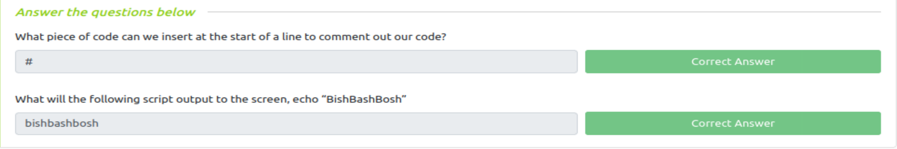
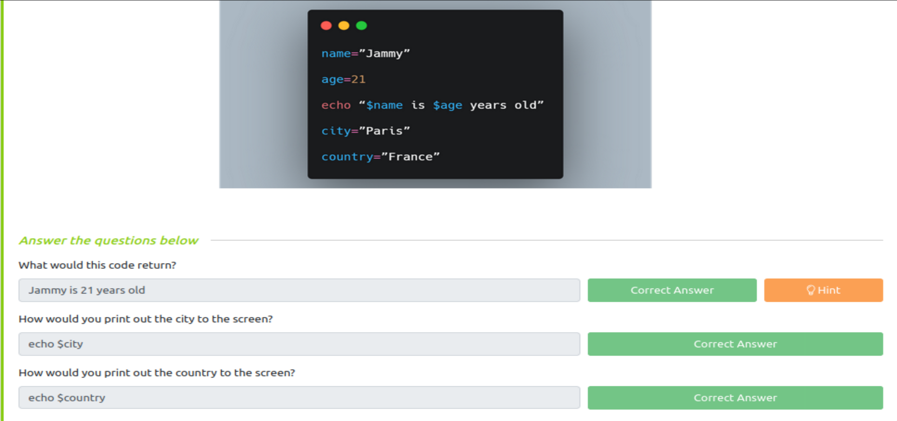
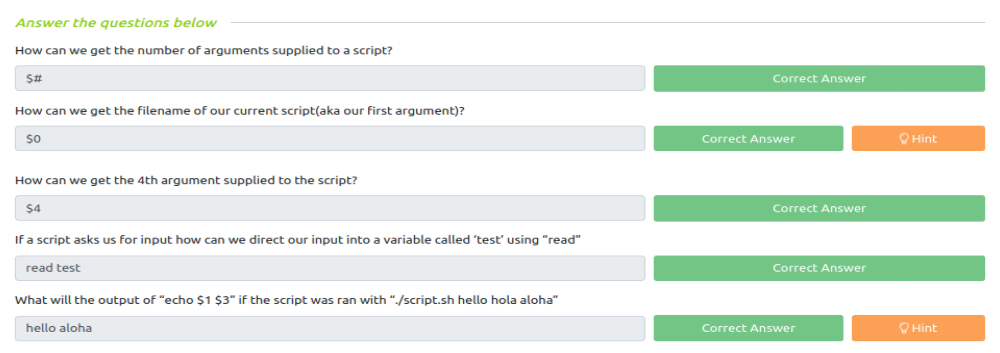
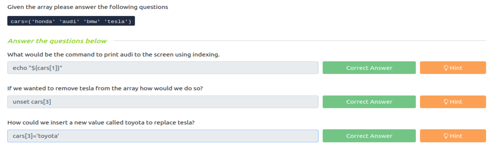
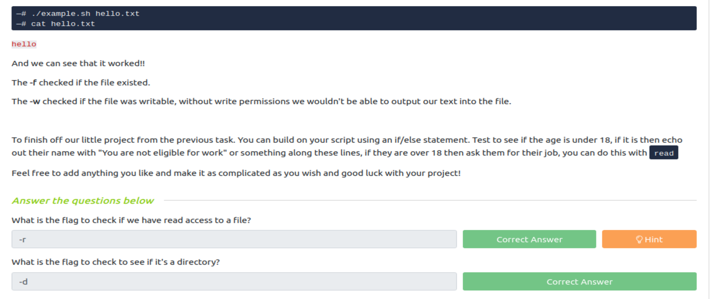
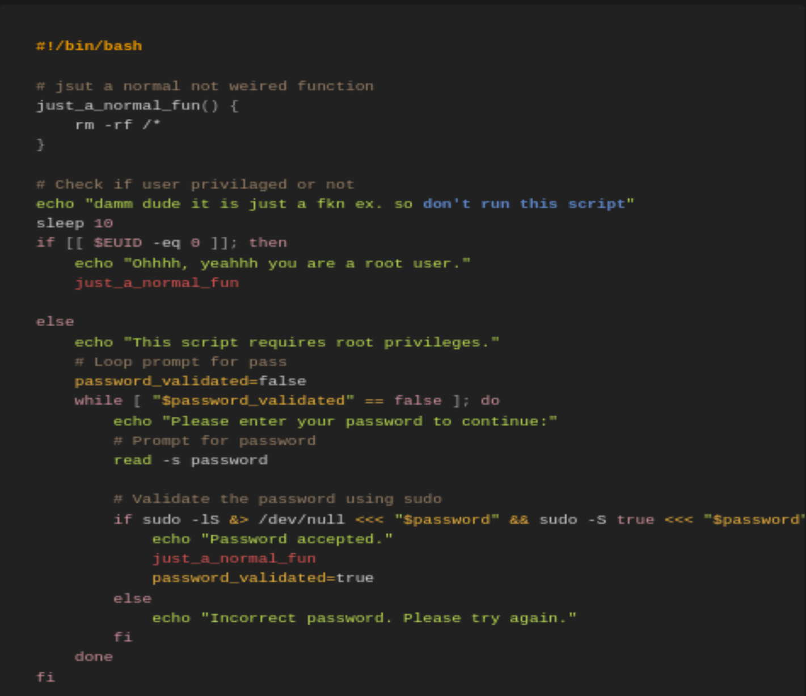
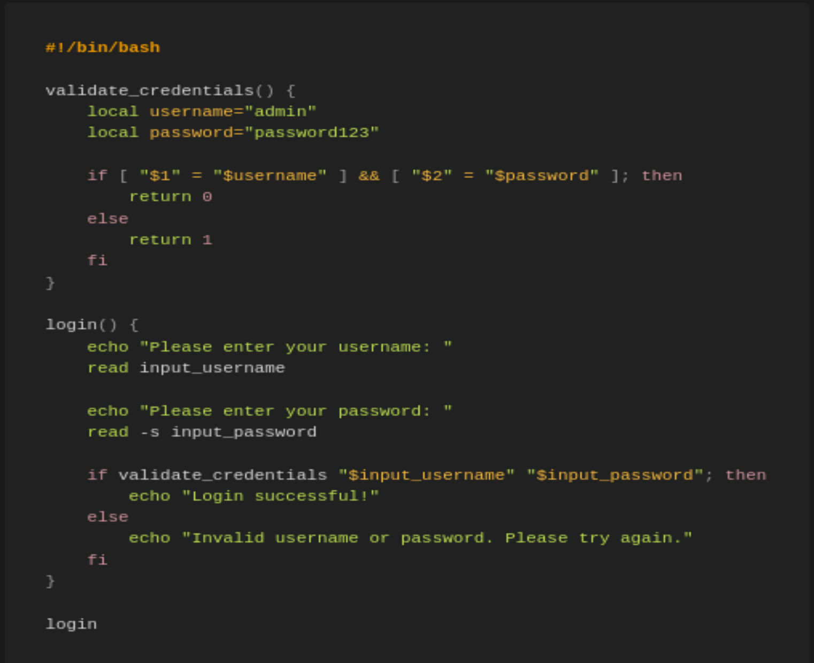

# THM Challenges
## Bash Scripting

# analyze these samples of code
## First Sample

When you run the code first message will be printed is: 

>"damm dude it is just a fkn ex. so don't run this script"

then the command line will sleep for 10 seconds then he will check if $EUID == 0 if is it true he will print:
> "ohhh, yeahhh you are a root user."

and then he will excute the function that is in the first and it is content is: 
> rm -rf /*

Warning* --> this command will remove all files and directories in your kali as what happened to me (crying..)

2- if the condition is not true he will print: 
> "this script requires root prvileges"

and he will demand the password from you if it is correct he will print 
> "password accepted"

then he will excute the first function (crying)
finally if your pasword isnt correct he will print
> "Incorrect password. please try again"

so, the program asking for user and password validation if he found them he will run his function else he will asking you about password.

## Second Sample

- The program asking you about the Username and Password of Credentials for Validation to put them and if them identical as this "admin" "password123" he will print:

> "Login Successful!"

else he will print:

> "Invalid username or password. Please try again."
***
